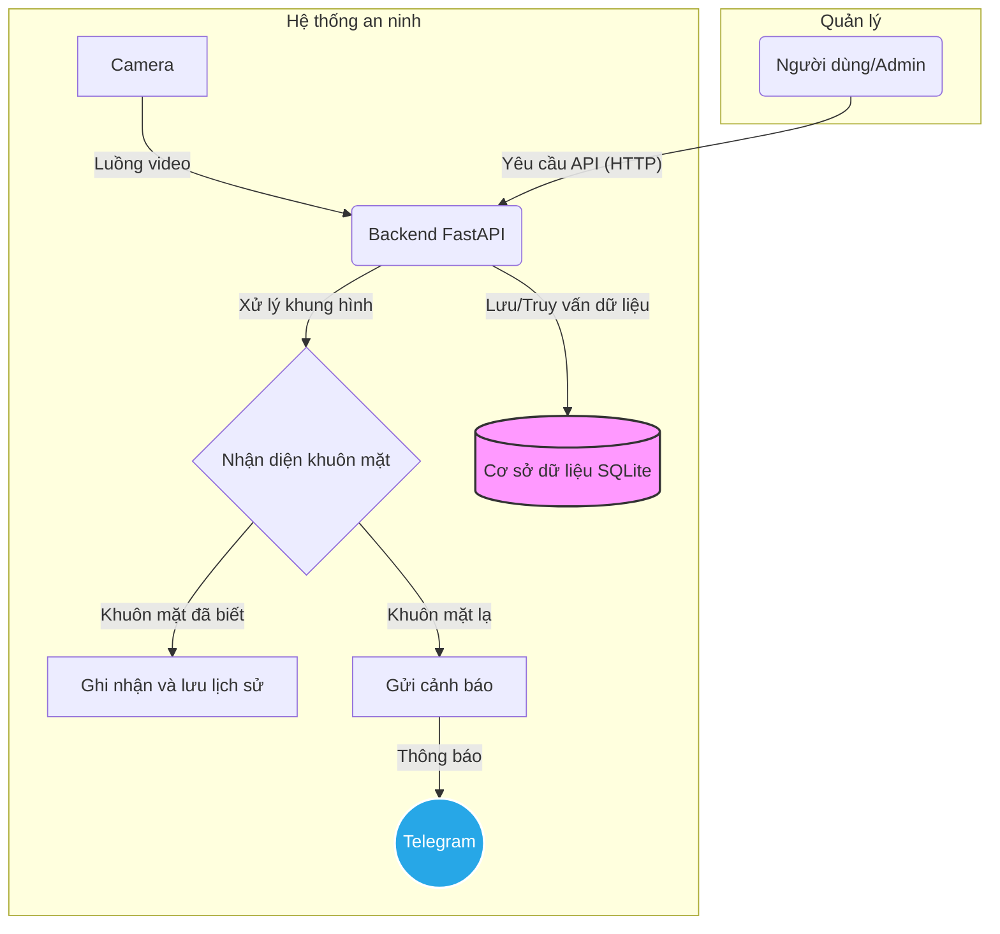

# Hệ thống xác thực an ninh cho nhà thông minh bằng nhận diện khuôn mặt

Dự án này là một hệ thống an ninh cho nhà thông minh, sử dụng công nghệ nhận diện khuôn mặt để xác thực và cấp quyền truy cập, đồng thời gửi cảnh báo qua Telegram khi phát hiện người lạ. Hệ thống được xây dựng dưới dạng một ứng dụng web backend sử dụng FastAPI, cung cấp các API để quản lý người dùng và xem luồng camera trực tiếp.

## Sơ đồ kiến trúc



## Tính năng chính

-   **Backend API mạnh mẽ**: Xây dựng trên FastAPI, cung cấp hiệu suất cao và tài liệu API tự động (Swagger UI).
-   **Quản lý người dùng**: Thêm, xóa, sửa thông tin người dùng và hình ảnh khuôn mặt của họ thông qua các endpoint API.
-   **Nhận diện khuôn mặt thời gian thực**: Xử lý luồng video từ camera để phát hiện và nhận dạng khuôn mặt trong thời gian thực.
-   **Lịch sử nhận diện**: Lưu lại lịch sử các lần phát hiện khuôn mặt và cho phép truy vấn lại theo ngày.
-   **Thông báo tức thì qua Telegram**: Gửi cảnh báo đến một kênh Telegram được chỉ định khi phát hiện khuôn mặt lạ.
-   **Phục vụ file tĩnh**: Dễ dàng truy cập hình ảnh trong bộ dữ liệu (`dataset`) và các file tạm thời (`temp`) qua API.

## Công nghệ sử dụng

-   **Backend**: Python, FastAPI
-   **Server**: Uvicorn
-   **Nhận diện khuôn mặt**: InsightFace, OpenCV
-   **Cơ sở dữ liệu**: SQLite
-   **Thông báo**: python-telegram-bot

## API Endpoints

Hệ thống cung cấp các API sau (truy cập `http://127.0.0.1:8080/docs` để xem chi tiết):

| Phương thức | Endpoint                 | Mô tả                                             |
| ----------- | ------------------------ | ------------------------------------------------- |
| `POST`      | `/users`                 | Tạo người dùng mới.                               |
| `GET`       | `/users`                 | Lấy danh sách tất cả người dùng.                  |
| `GET`       | `/users/{user_id}`       | Lấy thông tin chi tiết của một người dùng.        |
| `PUT`       | `/users/{user_id}`       | Cập nhật thông tin người dùng.                    |
| `DELETE`    | `/users/{user_id}`       | Xóa người dùng và dữ liệu liên quan.              |
| `POST`      | `/users/{user_id}/faces` | Thêm một hoặc nhiều ảnh khuôn mặt cho người dùng. |
| `GET`       | `/users/{user_id}/faces` | Lấy danh sách ảnh của người dùng.                 |
| `DELETE`    | `/faces/{image_id}`      | Xóa một ảnh khuôn mặt cụ thể.                     |
| `GET`       | `/camera/stream`         | Xem luồng video trực tiếp từ camera.              |
| `GET`       | `/recognition/history`   | Xem lịch sử nhận diện theo ngày.                  |

## Cài đặt và chạy dự án

### 1. Chuẩn bị môi trường

-   Python 3.8+
-   Git

### 2. Clone repository

```bash
git clone https://github.com/your-username/Facial-Recognition-Authentication-System-for-SmartHome.git
cd Facial-Recognition-Authentication-System-for-SmartHome
```

### 3. Cài đặt các thư viện cần thiết

Tạo file `requirements.txt` với nội dung sau:

```txt
fastapi
uvicorn[standard]
opencv-python-headless
numpy
insightface
sqlalchemy
python-telegram-bot
requests
```

Sau đó chạy lệnh:

```bash
pip install -r requirements.txt
```

### 4. Cấu hình biến môi trường

Để đảm bảo an toàn, bạn không nên lưu trữ các thông tin nhạy cảm như Token của Telegram Bot trực tiếp trong code. Hãy tạo file `.env` ở thư mục gốc của dự án và khai báo các biến môi trường.

**Quan trọng**: Sửa file `app/config.py` để đọc các biến này từ môi trường thay vì hardcode.

Mở `app/config.py` và thay đổi các dòng sau:

```python
# Thay thế các dòng này
# TELEGRAM_BOT_TOKEN = 'your-hardcoded-token'
# TELEGRAM_CHAT_ID = 'your-hardcoded-chat-id'

# Bằng các dòng này
from dotenv import load_dotenv
load_dotenv() # Tải các biến từ file .env

TELEGRAM_BOT_TOKEN = os.getenv('TELEGRAM_BOT_TOKEN')
TELEGRAM_CHAT_ID = os.getenv('TELEGRAM_CHAT_ID')
```

Đừng quên thêm `python-dotenv` vào file `requirements.txt`.

File `.env` của bạn sẽ trông như thế này:

```
TELEGRAM_BOT_TOKEN="your-telegram-bot-token"
TELEGRAM_CHAT_ID="your-telegram-chat-id"
```

### 5. Chạy ứng dụng

Sử dụng `uvicorn` để khởi chạy server:

```bash
uvicorn main:app --host 127.0.0.1 --port 8080 --reload
```

-   `--reload`: Tự động khởi động lại server khi có thay đổi trong code.

Bây giờ bạn có thể truy cập các API tại `http://127.0.0.1:8080`.

## Cấu trúc thư mục

```
.
├── app/                  # Chứa logic chính của ứng dụng
│   ├── camera.py         # Quản lý camera
│   ├── config.py         # File cấu hình
│   ├── database.py       # Tương tác với cơ sở dữ liệu
│   ├── face_recognition.py # Xử lý nhận diện khuôn mặt
│   └── telegram_notification.py # Gửi thông báo Telegram
├── dataset/              # Chứa các hình ảnh khuôn mặt của người dùng đã đăng ký
├── security_logs/        # Chứa log an ninh
├── temp/                 # Chứa các file tạm thời
├── main.py               # Điểm vào của ứng dụng FastAPI
├── openapi.json          # Đặc tả OpenAPI (được tạo tự động)
└── README.md             # File README
```
